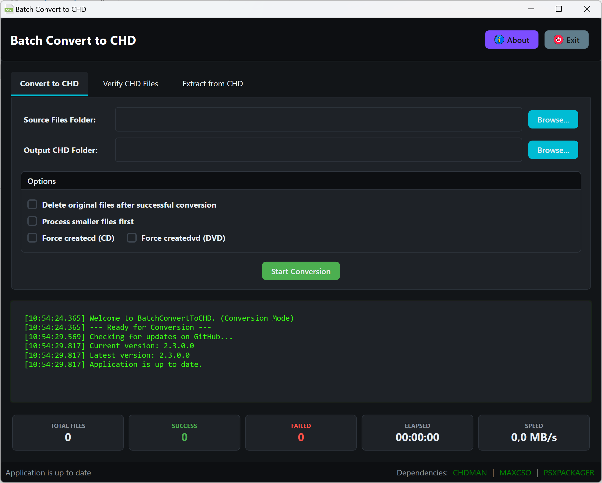

# Batch Convert to CHD

A Windows desktop utility for batch converting various disk image formats to CHD (Compressed Hunks of Data) format and for verifying the integrity of existing CHD files.

## Overview

Batch Convert to CHD is a Windows application that provides a simple user interface for converting multiple disk image files to the CHD format.
It uses **CHDMAN** from the MAME project for the actual conversions, while providing a user-friendly interface for batch processing.
It also supports extracting disk images from archives and allows parallel conversion for improved performance.

## Features

- **Batch Processing**: Convert multiple files in a single operation.
- **Multiple Format Support**: Handles a wide range of disk image formats including CD, DVD, GD-ROM, and HDD image formats.
- **Archive Support**: Automatically extracts and processes supported files from `.zip`, `.7z`, and `.rar` archives.
- **7-Zip Integration**: Uses `7z.exe` for `.7z` and `.rar` extraction, included with the application.
- **Parallel Processing**: Optionally process multiple files in parallel to speed up batch conversion.
- **Progress Tracking**: Detailed progress indication and real-time logging during the conversion process.
- **Delete Original Option**: Option to remove source files (including archives and referenced files) after successful conversion.
- **Global Error Reporting**: Automatic bug reporting to the developer with comprehensive error details.
- **User-Friendly Interface**: Simple and intuitive Windows interface, including drag-and-drop support.

## Supported File Formats

- **CUE+BIN files** (CD images)
- **ISO files** (CD images)
- **CDI files** (CD images)
- **GDI files** (GD-ROM images)
- **TOC files** (CD images)
- **IMG files** (Hard disk images)
- **RAW files** (Raw data)
- **ZIP, 7Z, RAR archives** (containing any of the above formats)

## Requirements

- Windows 7 or later
- [.NET 9.0 Runtime](https://dotnet.microsoft.com/download/dotnet/9.0)
- `chdman.exe` (included with the application)
- `7z.exe` and optionally `7z.dll` for archive extraction (included with the application)

## Installation

1. Download the latest release.
2. Extract the ZIP file to a folder of your choice.
3. Run `BatchConvertToCHD.exe`.

## Usage

1. **Select Input Folder**: Click "Browse" next to "Input Folder" to select the folder containing files (or archives) to convert.
2. **Select Output Folder**: Click "Browse" next to "Output Folder" to choose where the CHD files will be saved.
3. **Delete Option**: Check "Delete original files after conversion" if you want to remove source files (including archives and referenced files) after successful conversion.
4. **Parallel Processing Option**: Check "Enable parallel processing" to convert multiple files concurrently for faster batch completion.
5. **Start Conversion**: Click "Start Conversion" to begin the batch process.
6. **Monitor Progress**: The application displays progress bars and detailed log messages for each file during conversion.
7. **Cancel (if needed)**: Click "Cancel" to stop the ongoing conversion process gracefully.

## About CHD Format

CHD (Compressed Hunks of Data) is a compressed disk image format developed for the MAME project. It offers several advantages:

- **Efficient Compression**: Significantly reduces file sizes compared to raw disk images.
- **Metadata Storage**: Preserves important disk metadata such as track layout and region codes.
- **Check-summing**: Includes data verification to ensure image integrity.
- **Multiple Compression Methods**: Uses optimal compression methods to maximize size reduction.

## Why Use CHD?

- **Save Disk Space**: CHD files are often considerably smaller than original disk image formats.
- **Preserve All Data**: Unlike some compression methods, CHD retains all necessary data and metadata without loss.
- **MAME Compatibility**: Directly compatible with MAME and other emulators supporting the CHD format.
- **Data Integrity**: Built-in checks help ensure your disk images remain valid and uncorrupted.

## Troubleshooting

- Ensure `chdman.exe` and `7z.exe` are present in the same directory as the application.
- Make sure you have appropriate permissions to read from the input and write to the output directories.
- If `.7z` or `.rar` extraction is failing, verify that `7z.exe` is not missing.
- Review the application log window for detailed error messages during conversion.
- Automatic error reports will be sent to the developer if unexpected issues occur.

## Acknowledgements

- Use **CHDMAN** from the [MAME project](https://www.mamedev.org/) for CHD file conversions.
- Uses **7-Zip** (`7z.exe`) for extracting `.7z` and `.rar` archives.
- Developed by [Pure Logic Code](https://www.purelogiccode.com).

---

Thank you for using **Batch Convert to CHD**! For more information and support, visit [purelogiccode.com](https://www.purelogiccode.com).

