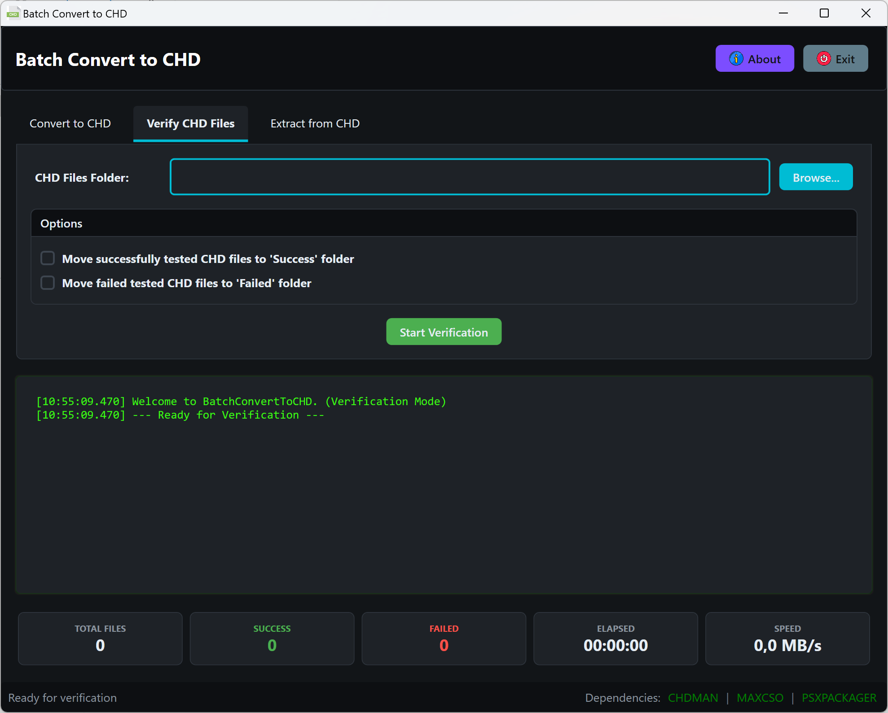

# Batch Convert to CHD

**Batch Convert to CHD** is a high-performance Windows desktop utility designed to streamline the conversion of various disk image formats into the **Compressed Hunks of Data (CHD)** format. By leveraging the industry-standard `chdman` (MAME) and `maxcso` tools, it provides a robust, user-friendly interface for batch processing, archive extraction, and data integrity verification.

## 🚀 Key Features

### Intelligent Conversion
*   **Automated Batch Processing**: Convert entire directories of disk images with real-time progress monitoring.
*   **Smart Command Selection**: Automatically detects the optimal `chdman` command (`createcd`, `createdvd`, `createhd`, or `createraw`) based on file headers and extensions.
*   **Archive Integration**: Transparently handles `.zip`, `.7z`, and `.rar` archives, extracting and processing contents automatically.
*   **CSO Decompression**: Built-in support for `.cso` (Compressed ISO) files via `maxcso` integration.
*   **Queue Optimization**: Option to process smaller files first to maximize throughput and manage temporary storage efficiently.

### Integrity & Verification
*   **Batch Verification**: Validate the checksums and structural integrity of existing CHD files.
*   **Automated Organization**: Optionally move verified or failed files into dedicated subfolders (`Success`/`Failed`) for easy library management.
*   **Recursive Scanning**: Support for deep-folder verification passes.

### Performance & UI
*   **Real-time Telemetry**: Monitor disk write speeds and elapsed time during operations.
*   **Safe File Handling**: Sanitizes filenames and utilizes temporary directories to prevent data corruption on network shares or restricted paths.
*   **Comprehensive Logging**: Detailed, timestamped logs for auditing and troubleshooting.

---

## 📂 Supported Formats

| Category | Formats |
| :--- | :--- |
| **Standard Images** | `.iso`, `.cue` (+`.bin`), `.img`, `.raw`, `.toc` |
| **Console Specific** | `.cdi` (Dreamcast/Saturn), `.gdi` (Dreamcast) |
| **Compressed** | `.cso` (Compressed ISO) |
| **Archives** | `.zip`, `.7z`, `.rar` |
| **Output** | `.chd` (Compressed Hunks of Data) |

---

## 🛠️ Technical Logic

The application implements a priority-based logic to ensure compatibility with various emulators and hardware:

1.  **DVD Images (`.iso`)**: Defaults to `createdvd`.
2.  **Hard Disk Images (`.img`)**: Defaults to `createhd`.
3.  **Raw Data (`.raw`)**: Defaults to `createraw`.
4.  **Multi-track/CD Images (`.cue`, `.cdi`, `.gdi`, `.toc`)**: Defaults to `createcd`.

*Users can manually override these settings via the UI to force specific modes for non-standard images.*

---

## 💻 Requirements

*   **Operating System**: Windows 10 / 11 (64-bit recommended)
*   **Runtime**: [.NET 10.0 Desktop Runtime](https://dotnet.microsoft.com/download/dotnet/10.0)
*   **Bundled Dependencies**:
    *   `chdman.exe` (MAME Project)
    *   `maxcso.exe` (CSO Decompression)
    *   `7z_x64.dll` (SevenZipSharp library)

---

## 📥 Installation

1.  Download the latest binary from the [Releases](https://github.com/drpetersonfernandes/BatchConvertToCHD/releases) page.
2.  Extract the contents to a permanent folder.
3.  Ensure `chdman.exe`, `maxcso.exe`, and `7z_x64.dll` remain in the same directory as `BatchConvertToCHD.exe`.
4.  Launch the application.

---

## 📖 Usage

### Conversion Workflow
1.  Navigate to the **Convert to CHD** tab.
2.  Select your **Source Folder** (containing images or archives).
3.  Select your **Output Folder**.
4.  *(Optional)* Enable "Delete original files" to clean up source data after a successful conversion.
5.  Click **Start Conversion**.

### Verification Workflow
1.  Navigate to the **Verify CHD Files** tab.
2.  Select the folder containing your `.chd` files.
3.  Configure folder organization options (Success/Failed folders).
4.  Click **Start Verification**.

---

## 🤝 Contributing & Support

If you encounter issues or have feature requests, please use the [GitHub Issues](https://github.com/drpetersonfernandes/BatchConvertToCHD/issues) tracker.

**Support the Project:**
If this tool saves you time, consider supporting further development:
*   ⭐ **Star this repository** on GitHub.
*   ☕ **Donate**: [purelogiccode.com/donate](https://www.purelogiccode.com/donate)

---

## 📜 License

This project is licensed under the **GNU General Public License v3.0**. See the [LICENSE.txt](LICENSE.txt) file for details.

**Acknowledgements:**
*   [MAME Team](https://www.mamedev.org/) for `chdman`.
*   [unknownbrackets](https://github.com/unknownbrackets/maxcso) for `maxcso`.
*   [SevenZipSharp](https://github.com/squid-box/SevenZipSharp) for archive handling.

---
Developed by [Pure Logic Code](https://www.purelogiccode.com)