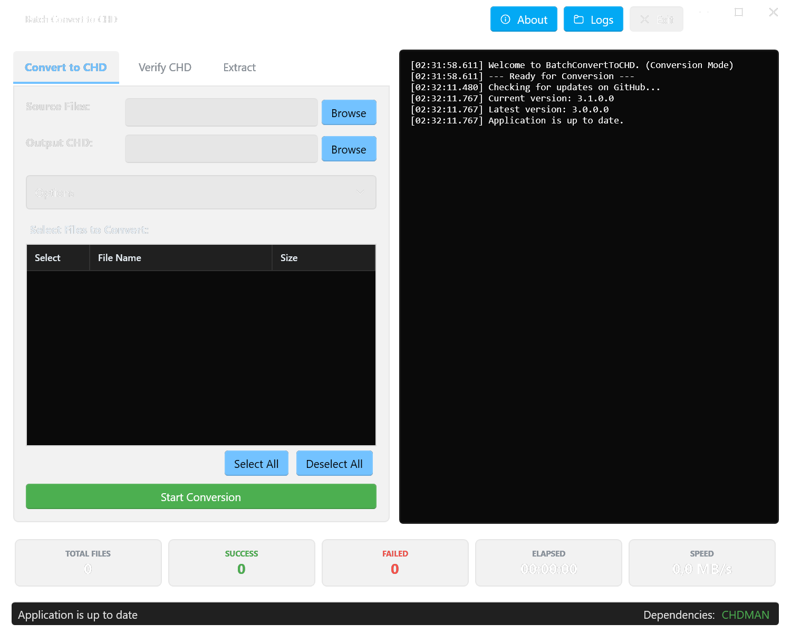
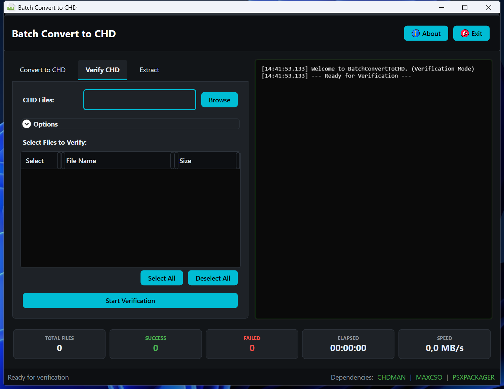
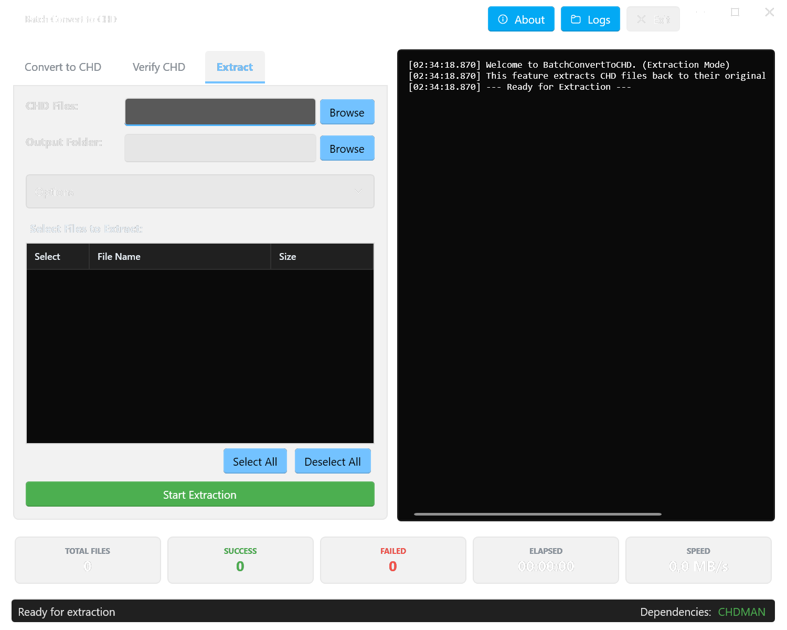

# Batch Convert to CHD

**Batch Convert to CHD** is a high-performance Windows desktop utility designed to streamline the conversion of various disk image formats into the **Compressed Hunks of Data (CHD)** format.

## 🚀 Key Features

### 💻 Modern Side-by-Side Dashboard
*   **Dual-Pane Interface**: View your settings and file list on the left, while monitoring real-time process logs on the right.
*   **Interactive File Selection**: Automatically scans folders and allows you to manually pick exactly which files to process via a detailed file list.
*   **Optimized File Loader**: Utilizes a chunked loading strategy to maintain UI responsiveness even when scanning directories with thousands of files.
*   **Resizable Layout**: Includes a built-in grid splitter to adjust the balance between the file explorer and the terminal view.

### 💻 Multi-Architecture Support
*   **Native ARM64 & x64**: Automatically detects your system architecture and utilizes the appropriate `chdman` binaries for maximum efficiency.
*   **Optimized Performance**: Leverages native instructions on ARM64 hardware to reduce overhead during heavy compression tasks.

### 🛠️ Intelligent Conversion & Extraction
*   **Automated Batch Processing**: Convert entire directories of disk images with real-time progress monitoring and immediate cancellation response.
*   **Recursive Structure Preservation**: Maintains your original directory hierarchy in the output folder when processing subfolders.
*   **CloneCD Support**: Smart detection of `.img` files that belong to CloneCD sets (via `.ccd` files), automatically ensuring the correct `createcd` command is used.
*   **Robust Extraction**: Supports extracting CHD files back to **.cue (CD)**, **.iso (DVD)**, **.gdi (Dreamcast/Naomi)**, and **.img (HDD)** with intelligent metadata auto-detection.
*   **Archive Integration**: Transparently handles `.zip`, `.7z`, and `.rar` archives, extracting and processing contents automatically while respecting cancellation tokens.
*   **CSO Decompression**: Built-in support for `.cso` (Compressed ISO) files via `maxcso` integration.
*   **PBP Extraction**: Convert PlayStation Portable `.pbp` files to CHD format via `psxpackager` integration.

### ✅ Integrity, Safety & Verification
*   **Safe Deletion**: Source files (and their dependencies like `.bin`, `.sub`, etc.) are only deleted if the conversion/extraction is confirmed successful.
*   **Batch Verification**: Validate the checksums and structural integrity of existing CHD files.
*   **Automated Organization**: Optionally move verified or failed files into dedicated subfolders (`Success`/`Failed`) while ignoring these special folders during subsequent scans.
*   **Cleanup**: Automatically removes empty subdirectories left behind after files are moved or deleted.
*   **Dependency Protection**: Performs a critical dependency check on startup to notify you if required components (like `chdman.exe`) are missing.

### 📊 Performance & UI
*   **Real-time Telemetry**: Monitor disk write/read speeds and elapsed time during operations.
*   **Optimized Logging**: High-performance logging system with automatic truncation to keep the application responsive during long-running tasks.
*   **Centralized Styling**: Modern dark-themed UI with consistent, accessible design elements.

### 🔄 Updates & Stability
*   **Automatic Update Checks**: Notifies you immediately if a newer version is available on GitHub at startup.
*   **Automated Bug Reporting**: Built-in error reporting system helps improve the application by automatically sending crash reports (no personal data collected).

---

## 📂 Supported Formats

| Category             | Formats                                                                      |
|:---------------------|:-----------------------------------------------------------------------------|
| **Standard Images**  | `.iso`, `.cue` (+`.bin`), `.img`, `.ccd` (+`.sub`), `.raw`, `.toc`           |
| **Console Specific** | `.cdi` (Dreamcast/Saturn), `.gdi` (Dreamcast), `.pbp` (PlayStation Portable) |
| **Compressed**       | `.cso` (Compressed ISO)                                                      |
| **Archives**         | `.zip`, `.7z`, `.rar`                                                        |
| **Output**           | `.chd` (Compressed Hunks of Data)                                            |

---

## 🛠️ Technical Logic

The application implements priority-based logic to ensure compatibility:

1.  **DVD Images (`.iso`)**: Defaults to `createdvd`.
2.  **CloneCD / Multi-track Images (`.ccd`, `.cue`, `.cdi`, `.gdi`, `.toc`)**: Defaults to `createcd`.
3.  **Hard Disk Images (`.img`)**: Defaults to `createhd` unless an accompanying `.ccd` file is detected.
4.  **Raw Data (`.raw`)**: Defaults to `createraw`.
5.  **PlayStation PBP (`.pbp`)**: Extracts to CUE/BIN using `psxpackager`, then converts to CHD using `createcd`.

*Note: Users can manually override these settings via the UI to force specific modes (except for PBP which always extracts first).*

---

## 💻 Requirements

*   **Operating System**: Windows 10 / 11 (x64 or ARM64)
*   **Runtime**: [.NET 10.0 Desktop Runtime](https://dotnet.microsoft.com/download/dotnet/10.0)
*   **Bundled Dependencies**:
    *   `chdman.exe` / `chdman_arm64.exe` (MAME Project)
    *   `maxcso.exe` (CSO Decompression - x64 only)
    *   `psxpackager.exe` (PBP Extraction)
*   **NuGet Dependencies**:
    *   [SharpCompress](https://github.com/adamhathcock/sharpcompress) (v0.46.2) - Archive extraction support

---

## 📥 Installation

1.  Download the latest binary from the [Releases](https://github.com/drpetersonfernandes/BatchConvertToCHD/releases) page.
2.  Extract the contents to a permanent folder.
3.  **Important**: Ensure all `.exe` files (including ARM64 variants) remain in the same directory as `BatchConvertToCHD.exe`.
4.  Launch the application.

---

## 📖 Usage

### Conversion Workflow
1.  Navigate to the **Convert to CHD** tab.
2.  Select your **Source Folder** (containing images or archives).
3.  Select your **Output Folder**.
4.  *(Optional)* Enable "Delete original files" to clean up source data after a successful conversion.
5.  Click **Start Conversion**.

### Verification Workflow
1.  Navigate to the **Verify CHD Files** tab.
2.  Select the folder containing your `.chd` files.
3.  Configure folder organization options (Success/Failed folders).
4.  Click **Start Verification**.

---

## 🤝 Contributing & Support

If you encounter issues or have feature requests, please use the [GitHub Issues](https://github.com/drpetersonfernandes/BatchConvertToCHD/issues) tracker.

**Support the Project:**
If this tool saves you time, consider supporting further development:
*   ⭐ **Star this repository** on GitHub.
*   ☕ **Donate**: [purelogiccode.com/donate](https://www.purelogiccode.com/donate)

---

## 📜 License

This project is licensed under the **GNU General Public License v3.0**. See the [LICENSE.txt](LICENSE.txt) file for details.

**Acknowledgements:**
*   [MAME Team](https://www.mamedev.org/) for `chdman`.
*   [unknownbrackets](https://github.com/unknownbrackets/maxcso) for `maxcso`.
*   [PSXPackager](https://github.com/rupert-avery/psxpackager) for PlayStation PBP extraction support.
*   [SharpCompress](https://github.com/adamhathcock/sharpcompress) for archive handling.

---
Developed by [Pure Logic Code](https://www.purelogiccode.com)
