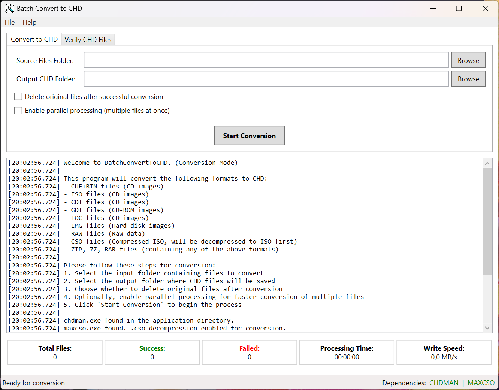

# Batch Convert to CHD

A Windows desktop utility for batch converting various disk image formats to CHD (Compressed Hunks of Data) format and for verifying the integrity of existing CHD files.

## Overview

Batch Convert to CHD is a Windows application that provides a simple user interface for converting multiple disk image files to the CHD format and verifying existing CHD files. It uses **CHDMAN** from the MAME project for the actual conversions and verifications, while providing a user-friendly interface for batch processing. The application supports extracting disk images from archives, and comprehensive CHD file verification.

⭐ **If you find this tool useful, please give us a Star on GitHub!** ⭐

## Features

### Conversion Features
- **Batch Processing**: Convert multiple files in a single operation with real-time progress tracking
- **Multiple Format Support**: Handles CD, DVD, GD-ROM, and HDD image formats
- **Archive Support**: Automatically extracts and processes files from `.zip`, `.7z`, and `.rar` archives
- **CSO Decompression**: Supports `.cso` (Compressed ISO) files with automatic decompression using maxcso
- **Smart Command Selection**: Automatically chooses the correct CHDMAN command (`createcd`, `createdvd`, etc.) based on file type
- **Smart File Handling**: Sanitizes file names and handles complex file paths safely by using temporary files for processing
- **Delete Original Option**: Remove source files (including archives and referenced files like .bin for .cue) after successful conversion
- **Process Smallest First**: Option to prioritize processing smaller files first, which can be useful for quicker feedback on progress or for systems with limited temporary storage.

### Verification Features
- **CHD Integrity Verification**: Verify the integrity of existing CHD files using CHDMAN
- **Batch Verification**: Process multiple CHD files in one operation
- **Subfolder Support**: Optionally include subfolders in verification scans
- **File Organization**: Move verified files to success/failed folders for easy organization
- **Detailed Reporting**: Comprehensive logging of verification results

### User Interface & Monitoring
- **Tabbed Interface**: Separate tabs for conversion and verification operations
- **Real-time Progress**: Live progress bars, file counts, and processing statistics
- **Write Speed Monitoring**: Real-time disk write speed display during conversion operations
- **Comprehensive Logging**: Detailed timestamped logs with error reporting
- **Cancellation Support**: Gracefully cancel operations in progress

## Conversion Logic (CHDMAN Commands)

The application automatically determines which `chdman` command to execute based on the file extension and user-selected overrides. This ensures the highest compatibility with different disc types.

### Automatic Detection
By default, the tool follows this priority logic:
1.  **`.iso` files**: Uses `createdvd`. This is the standard for DVD-based images.
2.  **`.img` files**: Uses `createhd`. This is intended for hard disk images.
3.  **`.raw` files**: Uses `createraw`.
4.  **All other formats (`.cue`, `.cdi`, `.gdi`, `.toc`)**: Uses `createcd`. This is the standard for CD and GD-ROM based images.

### Manual Overrides
You can manually force a specific mode using the checkboxes in the UI:
- **Force createcd (CD)**: Overrides the logic to use `createcd` regardless of the file extension (useful for non-standard `.iso` files that are actually CD-based).
- **Force createdvd (DVD)**: Overrides the logic to use `createdvd` regardless of the file extension.

## Supported File Formats

### Input Formats (Conversion)
- **CUE+BIN files** (CD images with track information)
- **ISO files** (CD/DVD images)
- **CDI files** (DiscJuggler CD images)
- **GDI files** (Dreamcast GD-ROM images)
- **TOC files** (CD images with table of contents)
- **IMG files** (Hard disk images)
- **RAW files** (Raw sector data)
- **CSO files** (Compressed ISO files - requires maxcso.exe)
- **Archive files**: ZIP, 7Z, RAR (containing any of the above formats)

### Output Format
- **CHD files** (Compressed Hunks of Data)—optimized for emulation

## Requirements

- **Operating System**: Windows 7 or later (64-bit recommended)
- **Runtime**: [.NET 10.0 Runtime](https://dotnet.microsoft.com/download/dotnet/10.0)
- **Dependencies** (included with application):
    - `chdman.exe` - MAME CHD creation and verification tool
    - `maxcso.exe` - CSO decompression utility (optional, for .cso support)
    - `7z_x64.dll` - 7-Zip library for archive extraction

## Installation

1. Download the latest release from the [GitHub releases page](https://github.com/drpetersonfernandes/BatchConvertToCHD/releases)
2. Extract the ZIP file to a folder of your choice
3. Ensure all required executables (`chdman.exe`, `maxcso.exe`) and the `7z_x64.dll` library are in the same folder as `BatchConvertToCHD.exe`
4. Run `BatchConvertToCHD.exe`

## Usage

### Converting Disk Images to CHD

1. **Select the "Convert to CHD" tab**
2. **Choose Source Folder**: Click "Browse" next to "Source Files Folder" to select the folder containing files to convert
3. **Choose Output Folder**: Click "Browse" next to "Output CHD Folder" to select where CHD files will be saved
4. **Configure Options**:
    - Check "Delete original files after successful conversion" to remove source files after conversion
    - Check "Process smaller files first" to sort the conversion queue by file size.
    - Use "Force" checkboxes if you need to override the automatic command detection.
5. **Start Conversion**: Click "Start Conversion" to begin the process
6. **Monitor Progress**: View real-time progress, statistics, and detailed logs
7. **Cancel if Needed**: Click "Cancel" to gracefully stop the operation

### Verifying CHD Files

1. **Select the "Verify CHD Files" tab**
2. **Choose CHD Folder**: Click "Browse" to select the folder containing CHD files to verify
3. **Configure Options**:
    - Check "Include subfolders in CHD search" to scan subdirectories
    - Check "Move successfully tested CHD files to 'Success' folder" to organize verified files
    - Check "Move failed tested CHD files to 'Failed' folder" to separate problematic files
4. **Start Verification**: Click "Start Verification" to begin the process
5. **Review Results**: Check the logs and statistics for verification results

## About CHD Format

CHD (Compressed Hunks of Data) is a compressed disk image format developed for the MAME project that offers several advantages:

- **Efficient Compression**: Significantly reduces file sizes compared to raw disk images
- **Lossless Storage**: Preserves all original data and metadata without quality loss
- **Metadata Preservation**: Retains important disk information such as track layout and sector data
- **Data Integrity**: Built-in checksums ensure image validity and detect corruption
- **Emulator Compatibility**: Native support in MAME and many other emulators
- **Multiple Compression**: Uses different algorithms optimized for various data types

## Performance Tips

- **SSD Storage**: Store temporary files and output on SSD drives for better performance
- **File Organization**: Organize input files in a single folder for efficient batch processing

## Troubleshooting

### Common Issues
- **Missing Dependencies**: Ensure `chdman.exe` and `7z_x64.dll` are present in the application directory. `maxcso.exe` is also required for CSO support.
- **Permissions**: Verify read/write permissions for input and output directories
- **Disk Space**: Ensure sufficient free space in output and temporary directories
- **File Locks**: Close other applications that might be accessing the files

### Error Reporting
- The application automatically reports errors to the developer for analysis
- Check the log window for detailed error messages and troubleshooting information
- Review the GitHub issues page for known problems and solutions

### CSO File Support
- CSO decompression requires `maxcso.exe` in the application directory
- If maxcso.exe is missing, CSO files will be skipped during conversion

## Acknowledgements

- **CHDMAN**: Uses CHDMAN from the [MAME project](https://www.mamedev.org/) for CHD operations
- **MaxCSO**: Integrates maxcso for CSO file decompression
- **SevenZipSharp**: Uses SevenZipSharp library for archive extraction
- **Development**: Created by [Pure Logic Code](https://www.purelogiccode.com)

## Support & Contributing

- **Website**: [purelogiccode.com](https://www.purelogiccode.com)
- **GitHub**: [BatchConvertToCHD Repository](https://github.com/drpetersonfernandes/BatchConvertToCHD)
- **Issues**: Report bugs and request features on GitHub
- **Updates**: The application automatically checks for updates on startup

---
⭐ **Remember to Star this repository if you find it useful!** ⭐

If you like the software, consider donation on [purelogiccode.com/donate](https://www.purelogiccode.com/donate).